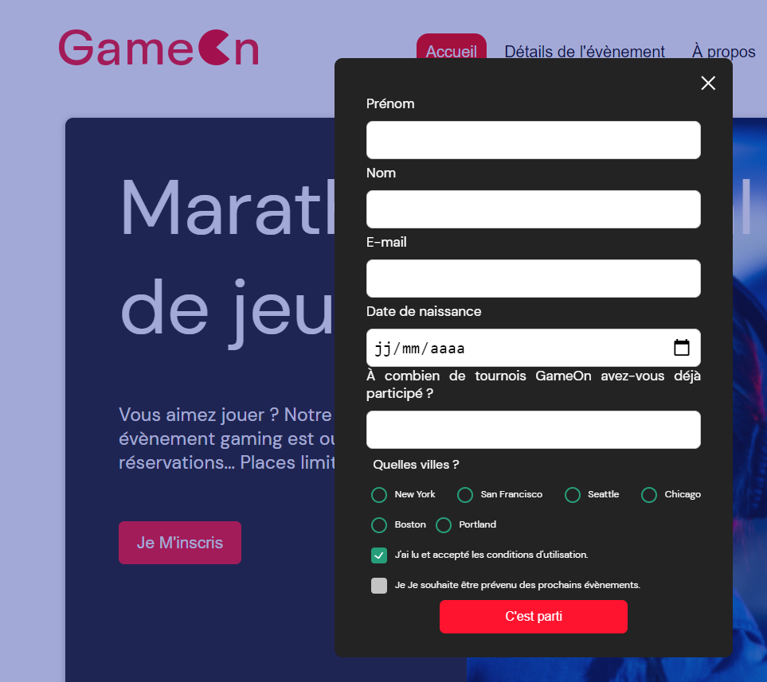

# Projet GameOn  

Le travail consiste à ajouter le code JavaScript manquant pour que le formulaire soit pleinement fonctionnel.

## Presentation des issues  
  
Corriger les issues ci dessous:  
**TODO_1** : fermer la modale  
**TODO_2**: Implémenter entrées du formulaire  
**TODO_3**: Ajouter validation ou messages d'erreur  
**TODO_4**: Ajouter confirmation quand envoie réussi  

## Commentaires de la part de l’équipe  

1. Forkez Le repo
2. Il est conseillé d'utiliser VisualStudio Code et vous pouvez utiliser Docker, mais ce n'est pas obligatoire ;
3. Il n'y a aucune dépendance ;
4. Vous ne devez utiliser que du CSS personnalisé et du JavaScript pur, sans jQuery, Bootstrap ou autre librairie.

### Lien du projet GameOn

* [GameOn](https://melaniemdm.github.io/GameOn-website-FR/starterOnly/)
